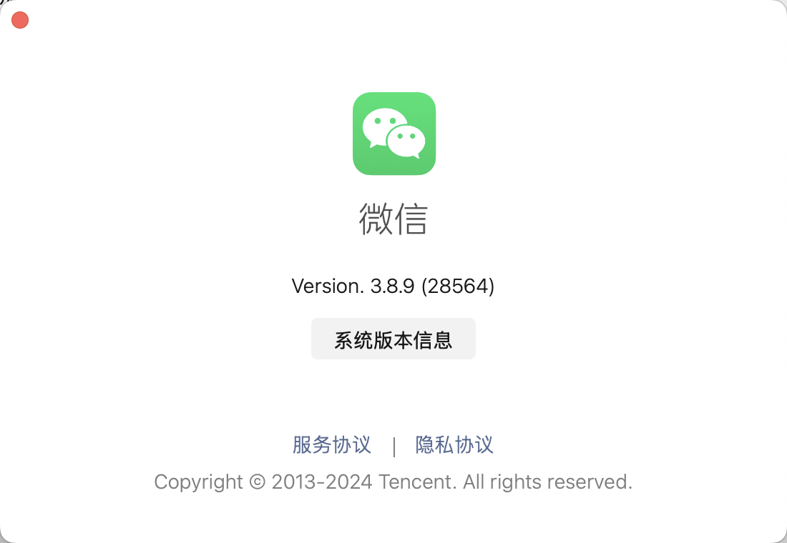
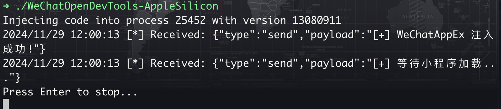
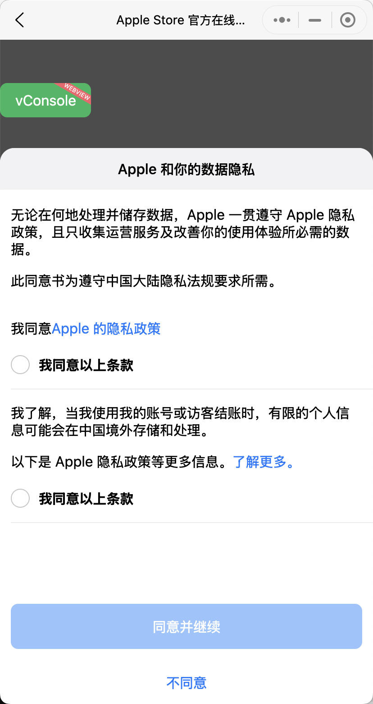
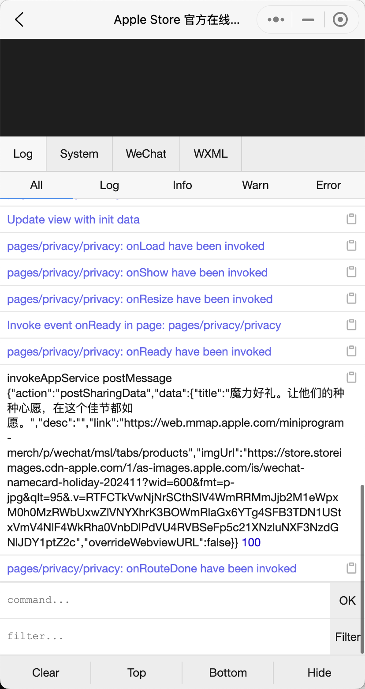

# WeChatOpenDevTools-AppleSilicon

<div align="center">


</div>

> 一个专为 Apple Silicon 芯片 Mac 打造的微信小程序开发工具增强插件。

## 📝 项目介绍

WeChatOpenDevTools-AppleSilicon 是一个专门为搭载 Apple Silicon 芯片的 Mac 设计的微信小程序开发工具增强插件。

### ✨ 主要特性

- 🔄 支持最新版本的微信小程序
- 💻 专为 Apple Silicon 架构优化设计
- 🛠️ 支持 VConsole 调试功能
- 🔍 支持 DevTools 开发工具
- ⚡️ 支持内置浏览器 F12 调试

## ⚠️ 免责声明

本项目仅供学习和研究使用。使用本工具产生的任何问题与本项目开发者无关。如本项目涉及任何侵权行为，请及时联系我们删除。

## 📋 版本支持

| MAC 微信版本 | 小程序版本 | 是否为最新版 | 支持内置浏览器F12 |
| ------------ | ---------- | ------------ | ----------------- |
| 3.8.9 (28564)| 13080911  | ✅           | ✅                |
| 3.8.8 (28538)| 13080813  | ❌           | ✅                |
| 3.8.8 (28486)| 13080812  | ❌           | ✅                |
| 3.8.7 (28245)| 13080712  | ❌           | ❌                |

## 🔧 使用要求

- macOS 操作系统（Apple Silicon 芯片）


## 🚀 使用方法

### 方式一：手动编译

1. 安装依赖
```bash
# 下载并解压 frida-core-devkit （也可以使用其他版本）
wget https://github.com/frida/frida/releases/download/16.5.6/frida-core-devkit-16.5.6-macos-arm64.tar.xz
tar -xvf frida-core-devkit-16.5.6-macos-arm64.tar.xz

# 安装必要文件
cp frida-core-devkit-16.5.6-macos-arm64/libfrida-core.a /usr/local/lib
cp frida-core-devkit-16.5.6-macos-arm64/frida-core.h /usr/local/include
```

2. 编译项目
```bash
# 克隆仓库
git clone https://github.com/fupinglee/WeChatOpenDevTools-AppleSilicon

# 进入项目目录
cd WeChatOpenDevTools-AppleSilicon

# 编译
go build
```

### 方式二：直接使用预编译版本

1. 从 [Releases](https://github.com/fupinglee/WeChatOpenDevTools-AppleSilicon/releases) 页面下载最新版本，同时需要下载configs文件夹和scripts文件夹到当前目录

2. 运行程序：
```bash
# 查看帮助
./WeChatOpenDevTools-AppleSilicon -h

# 自动查找进程
./WeChatOpenDevTools-AppleSilicon

# 指定进程 ID
./WeChatOpenDevTools-AppleSilicon -p <pid>
```

## 📷 功能展示

### 1. 微信版本信息


### 2. 程序运行界面


### 3. VConsole 调试功能




## 📄 开源协议

本项目采用 MIT 协议开源，详情请参见 [LICENSE](LICENSE) 文件。

## 📝 致谢

代码参考：[WeChatOpenDevTools-Python-arm](https://github.com/f4l1k/WeChatOpenDevTools-Python-arm) 只是把Python语言改用Go语言重写