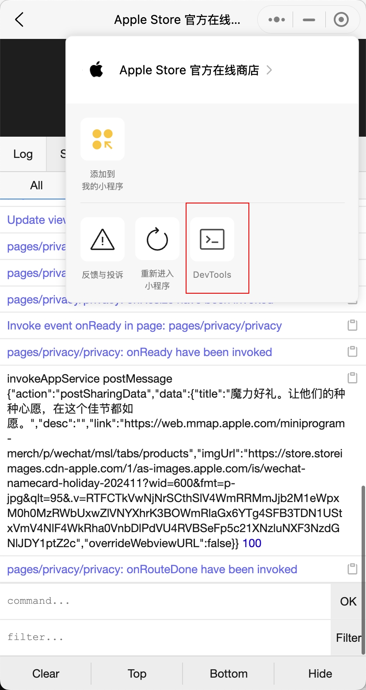
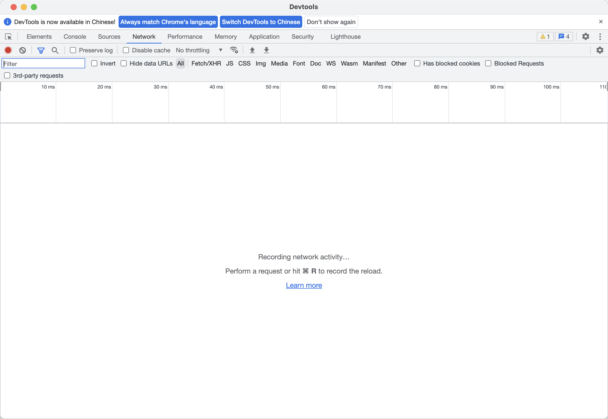

# WeChatOpenDevTools-AppleSilicon

<div align="center">


</div>

> 用于 Apple Silicon 芯片 Mac 的微信小程序开发工具增强插件

## ⚠️ 免责声明

**注意本库只能作为学习用途, 造成的任何问题与本库开发者无关, 如侵犯到你的权益，请联系删除！**


## ✨ 功能特性

- 支持最新版本的微信开发者工具
- 专为 Apple Silicon 架构设计
- 支持 VConsole、DevTools、内置 F12

## 📋 支持版本

| MAC 微信版本 | 小程序版本 | 是否为最新版 | 支持内置浏览器F12 |
| ---------------- | ---------- | ------------ | ------------ |
| 3.8.9 (28564)  | 13080911   | ✅           | ✅           |
| 3.8.8 (28538)  | 13080813   | ❌           | ✅           |
| 3.8.8 (28486)  | 13080812   | ❌           | ✅           |
| 3.8.7 (28245)  | 13080712   | ❌           | ❌           |

## 🚀 使用方法

### 快速开始

下载后直接运行以下命令：

```bash
# 查看帮助
./WeChatOpenDevTools-AppleSilicon -h

# 自动查找进程
./WeChatOpenDevTools-AppleSilicon

# 指定进程 ID
./WeChatOpenDevTools-AppleSilicon -p <pid>
```

### 功能展示

#### 1. 微信版本

<div style="clear: both; margin-bottom: 20px;">

</div>

#### 2. 运行程序

<div style="clear: both; margin-bottom: 20px;">

</div>

### 调试功能

#### 1. VConsole 开启

<div style="clear: both; margin-bottom: 20px;">

</div>

<div style="clear: both; margin-bottom: 20px;">

</div>

#### 2. DevTools 开启

<div style="clear: both; margin-bottom: 20px;">

</div>

<div style="clear: both; margin-bottom: 20px;">

</div>

#### 3. 内置 F12 开启

<div style="clear: both; margin-bottom: 20px;">

</div>

## 📝 致谢

代码参考：[WeChatOpenDevTools-Python-arm](https://github.com/f4l1k/WeChatOpenDevTools-Python-arm) 只是把Python语言改用Go语言重写